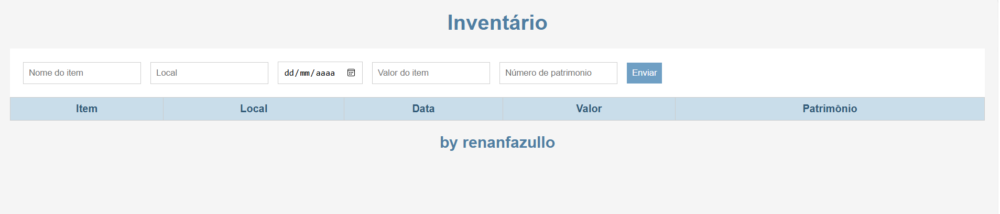

# Inventário

Projeto desenvolvido em aula de Back-end do SESI Amparo, simulando o cadastro e a listagem de bens de um inventário utilizando um servidor Node.js, Express e um arquivo JSON.

## Tecnologias
- JavaScript
- Node.js
- Express
- Cors
- HTML, CSS, JS
- JSON

## Passos para testar
- 1 Clone este repositório
- 2 Abra com VsCode e em um terminal execute

npm install
npm run dev

- 3 Execute o frontend abrindo o arquivo `client/index.html` com Live Server do VsCode

## Print da tela

